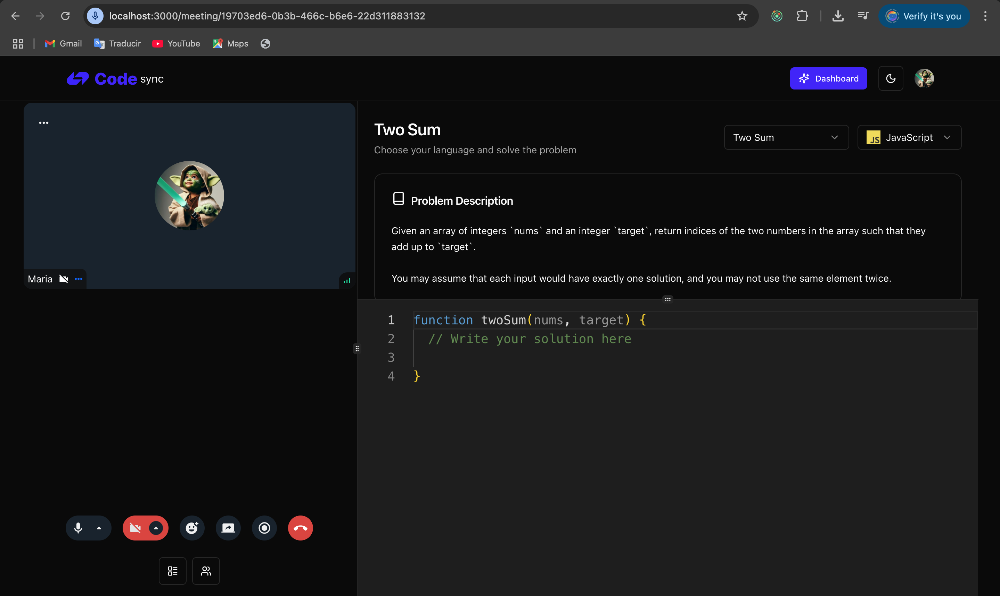

<h1 align="center">✨ Video Calling Interview Platform ✨</h1>



Highlights:

- 🚀 Tech stack: Next.js & TypeScript, Stream, Convex, Clerk
- 🎥 Video Calls
- 🖥️ Screen Sharing
- 🎬 Screen Recording
- 🔒 Authentication & Authorization
- 💻 Server Components, Layouts, Server Actions
- 🎭 Client & Server Components
- 🛣️ Dynamic & Static Routes
- 🎨 Styling with Tailwind & Shadcn
- ✨ Server Actions

### Setup .env file

```js
NEXT_PUBLIC_CLERK_PUBLISHABLE_KEY=pk_test_ZWFzeS10ZXJtaXRlLTgyLmNsZXJrLmFjY291bnRzLmRldiQ
CLERK_SECRET_KEY=sk_test_40ZJs20ZqC6szt5yuNAuBAd4fM1eX9TqmGNZRZCtO8

# Deployment used by `npx convex dev`
CONVEX_DEPLOYMENT=dev:next-fish-431 # team: hotaru842, project: codesync-2e717

NEXT_PUBLIC_CONVEX_URL=https://next-fish-431.convex.cloud

NEXT_PUBLIC_STREAM_API_KEY=6h2pnedwq2xk
STREAM_SECRET_KEY=vr6gsmaukm5vrbgupxdkhwh9nzzxcu6vjnub6quqwtrne36xaw6efzgxg8uy56nk
```

### Run the app

```shell
npm run dev
```
